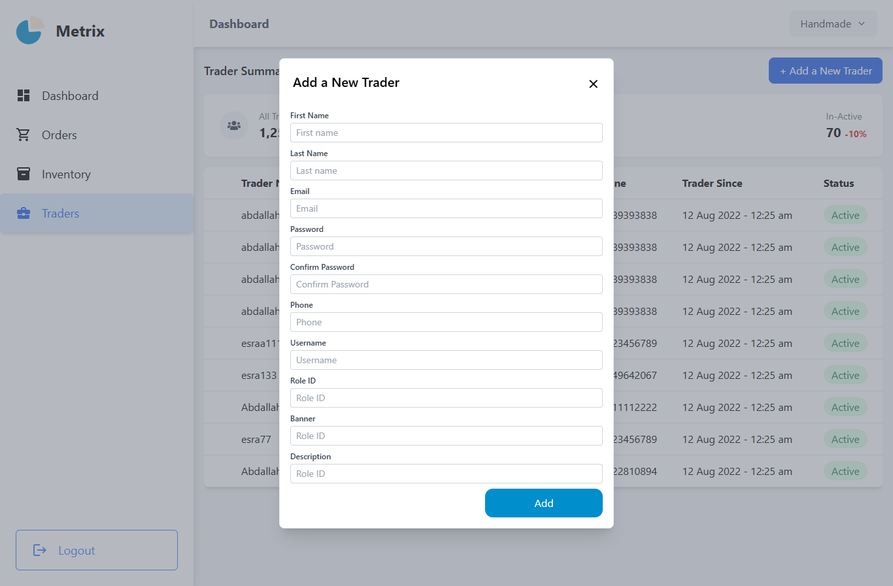

# 🧶 Herfety – Handmade Craft Marketplace

**Herfety** is an online marketplace for handmade products developed using **React.js** and **Redux** for state management. It provides a seamless environment for artisans and customers to connect, showcasing unique handmade products.

---

## 🎯 Project Overview

"Herfety" aims to empower artisans by providing a digital platform to sell their handmade crafts and connect with a wider audience. Customers can easily browse through different categories, add items to their cart, and make secure purchases.

---

## 👥 User Roles

- 👩‍🎨 **Artisan / Vendor**: Adds and manages their products and tracks orders.
- 👨‍💼 **Admin**: Manages the platform, including products, vendors, orders, and inventory.
- 🛍️ **Customer**: Browses products, adds them to the cart or wishlist, places orders, and tracks order status.

---

## 🚀 Features

### 👤 Customer Features

- Login and Registration.
- Browse products by category and brand.
- View product details.
- Add items to cart or wishlist.
- Track order status.
- Manage profile settings.

### 🧑‍🎨 Vendor Features

- Add new handmade products.
- Edit or delete their products.
- Track and manage orders.
- View product details.

### 🧑‍💼 Admin Features

- Admin Dashboard for managing products, vendors, and orders.
- Manage inventory and order details.
- Add, edit, and remove products.
- View vendor details and manage user accounts.

---

## 🛠️ Technologies Used

- **React.js** (Frontend)
- **Tailwind CSS** (Modern, responsive design)
- **Redux** (State Management)
- **React Router v6** (Routing and navigation)
- **React.lazy + Suspense** (Lazy loading for pages to improve performance)

---

## ⚡️ Using **Redux** in the Project

We use **Redux** for centralized state management across the application. This makes it easier to share and update data between different components in the app.

## 📸 Preview

# 1. Clone the project

git clone https://github.com/esraarabee1/handmade_.git

cd handmade\_

# 2. Install dependencies

npm install

# 3. Run the project

npm start
